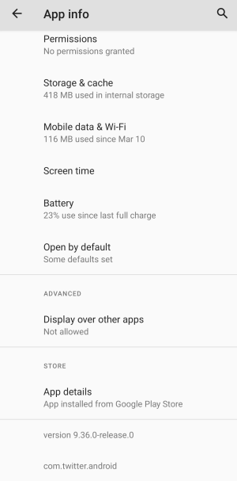
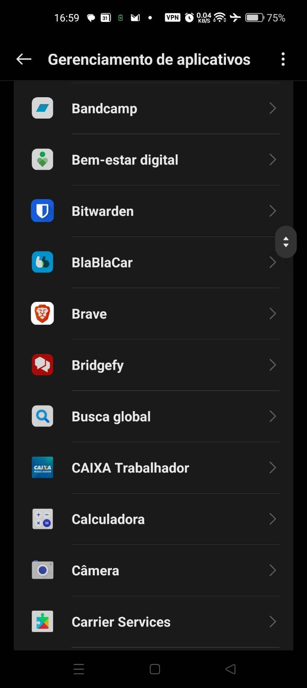
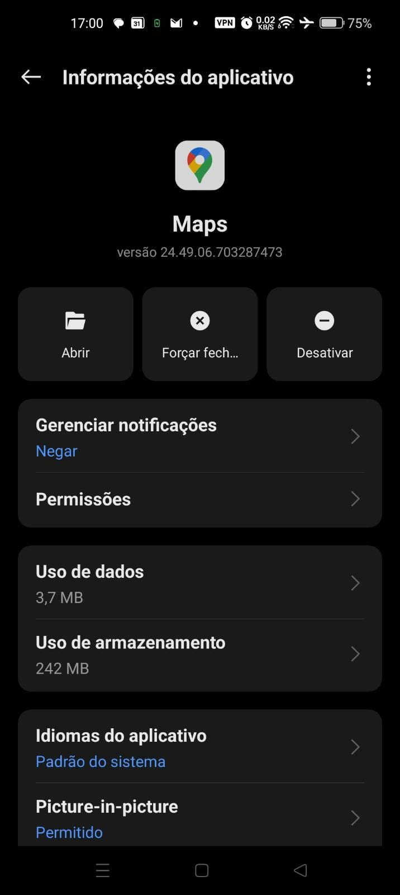
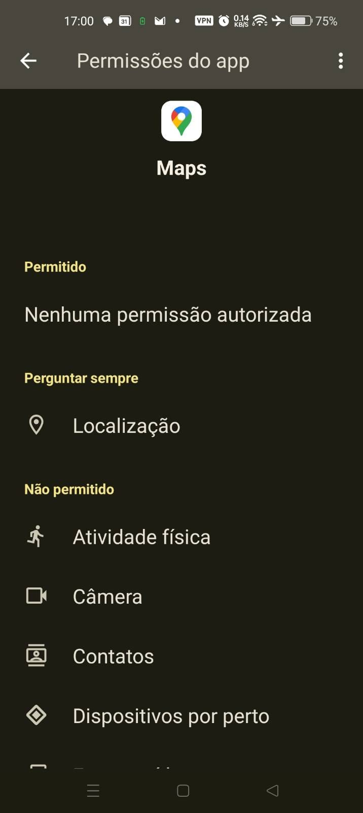

# Revisar aplicativos instalados

### ID do aplicativo

Alguns aplicativos mal-intencionados são apresentados como aplicativos legítimos, muitas vezes sendo uma cópia de um aplicativo legítimo com código mal-intencionado adicionado a eles. Para verificar o ID de cada aplicativo, vá para **Configurações > Aplicativos** e clique em cada aplicativo para verificar o respectivo ID, na parte inferior da página.

O ID do aplicativo deve refletir o nome exibido no aplicativo, por exemplo, o ID do aplicativo autêntico da “Play Store” é `com.android.vending`; no entanto, existem [malwares](https://www.tomsguide.com/news/octo-android-malware-can-take-over-your-phone-how-to-protect-yourself/) que fingem ser a Play Store com o ID `com.restthe71`.

#### Versão do aplicativo

Na página App Info, a versão do aplicativo também é exibida. É possível pesquisar a versão do aplicativo no Google para determinar se a versão realmente existe. Se houver muitos resultados de pesquisa retornados para a string de versão, ela provavelmente existe. Por exemplo, a captura de tela acima mostra que o aplicativo com.twitter.android versão 9.36.0-release0 está instalado, e a pesquisa por “twitter 9.36.0” retorna muitos resultados de pesquisa, o que indica que essa versão provavelmente é legítima. No entanto, se você vir algo como “versão 100”, então o aplicativo, provavelmente, é falso.

### Permissões

Mesmo que aplicativos falsos tenham sido instalados, eles ainda precisam de um número importante de permissões do Android para poderem monitorar seu telefone remotamente, portanto, a primeira etapa é verificar a lista de aplicativos instalados e suas permissões. Para fazer isso, acesse **Configurações (ou Ajustes) > Aplicativos**, ou dependendo da versão do Android, **Ajustes > Apps > Gerenciamento de Aplicativos.**

<figure><figcaption></figcaption></figure>

Esse menu mostra uma lista de todos os aplicativos instalados. Você deve visitar a página de cada um desses aplicativos e verificar as permissões permitidas para eles.

<figure><figcaption></figcaption></figure>

As seguintes permissões são especificamente suspeitas, pois são usadas com muita frequência por aplicativos mal-intencionados:

* Localização
* Contatos
* SMS
* Microfone
* Câmera
* Registros de chamadas
* Telefone

<figure><figcaption></figcaption></figure>

Também é interessante verificar outros parâmetros sobre esse aplicativo, que podem ou não ser exibidos dependendo de sua versão do Android:

* Verifique se o aplicativo foi instalado a partir da Google Play Store: procure por **Detalhes do aplicativo** ou **Detalhes do aplicativo na loja**
* Verifique se o aplicativo pode modificar as configurações do sistema ou se tem outro “Acesso especial a aplicações/apps”: procure pelas permissões **Modificar configurações do sistema** ou **Alterar configurações do sistema**.
* Verifique se o aplicativo tem permissão para instalar outros aplicativos, procure pela permissão **Instalar aplicativos desconhecidos**

### Aplicativos em execução

Para inspecionar os aplicativos em execução, siga [este guia](https://web.archive.org/web/20220509061723/https://www.techrepublic.com/article/how-to-view-all-running-services-on-android-11/).

Verifique os aplicativos desconhecidos em execução pesquisando seus nomes no Google.

Desative as Opções do desenvolvedor após inspecionar os aplicativos em execução para evitar o vazamento de informações.
