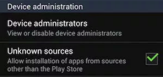

# Opcional: verificar se há indicadores de instalação de stalkerware

_Stalkerwares_ são aplicativos maliciosos usados ​​no contexto de violência de parceiros íntimos. Uma das diferenças com o malware Android clássico é que eles são instalados por meio de um acesso físico ao smartphone. Por isso, a instalação requer algumas alterações no sistema Android, que geralmente podem ser identificadas posteriormente.

## Verifique se a instalação de fontes desconhecidas está autorizada

Os aplicativos _stalkerware_ são instalados diretamente do arquivo do aplicativo (APK), que é proibido por padrão pelo Android. Para instalar o aplicativo, a pessoa precisa permitir a instalação de fontes desconhecidas.

Antes do Android 8 "Oreo", esse recurso era habilitado para todo o telefone. Se você tem um telefone anterior ao Android 8, vá para **Configurações > Segurança** e verifique se **Fontes desconhecidas** está habilitado.

Após o Android 8, esse recurso é habilitado por aplicativo. Vá para **Configurações > Segurança > Instalar aplicativos desconhecidos** ou , a depender da versao do Android, em **Configurações > Segurança e Privacidade > Mais Segurança e Privacidade > Fontes de Instalação** para ver a lista de aplicativos com permissão para instalar aplicativos não confiáveis.

<figure><figcaption></figcaption></figure>

Qualquer aplicativo com autorização de instalação de aplicações é suspeito, especialmente navegadores e gerenciadores de arquivos.

## Verifique se o Google Play Protect está desabilitado

O Google Play Protect é uma detecção automatizada de aplicativos maliciosos desenvolvida e mantida pelo Google como parte do Google Play Services. Esse recurso geralmente precisa ser desabilitado durante a instalação de um aplicativo _stalkerware_ porque ele pode detectar o aplicativo malicioso.

Para verificar essa configuração, você deve ir para **Configurações > Segurança > Verificar dispositivos em busca de ameaças à segurança** ou **Configurações > Segurança > Google Play Protect** ou **Configurações > Segurança e Privacidade > Google Play Protect** dependendo da sua versão do Android.

Em versões mais recentes, as telas para verificar o Play Protect pode se parecer com as seguintes:

<figure><figcaption></figcaption></figure>

<figure><figcaption></figcaption></figure>

## Verifique se o telefone foi "rooteado"

Um aplicativo _stalkerware_ geralmente requer um telefone rooteado para ter acesso a mais dados. Siga as recomendações [desta outra parte do guia](root.md) para verificar se o telefone está com root.
