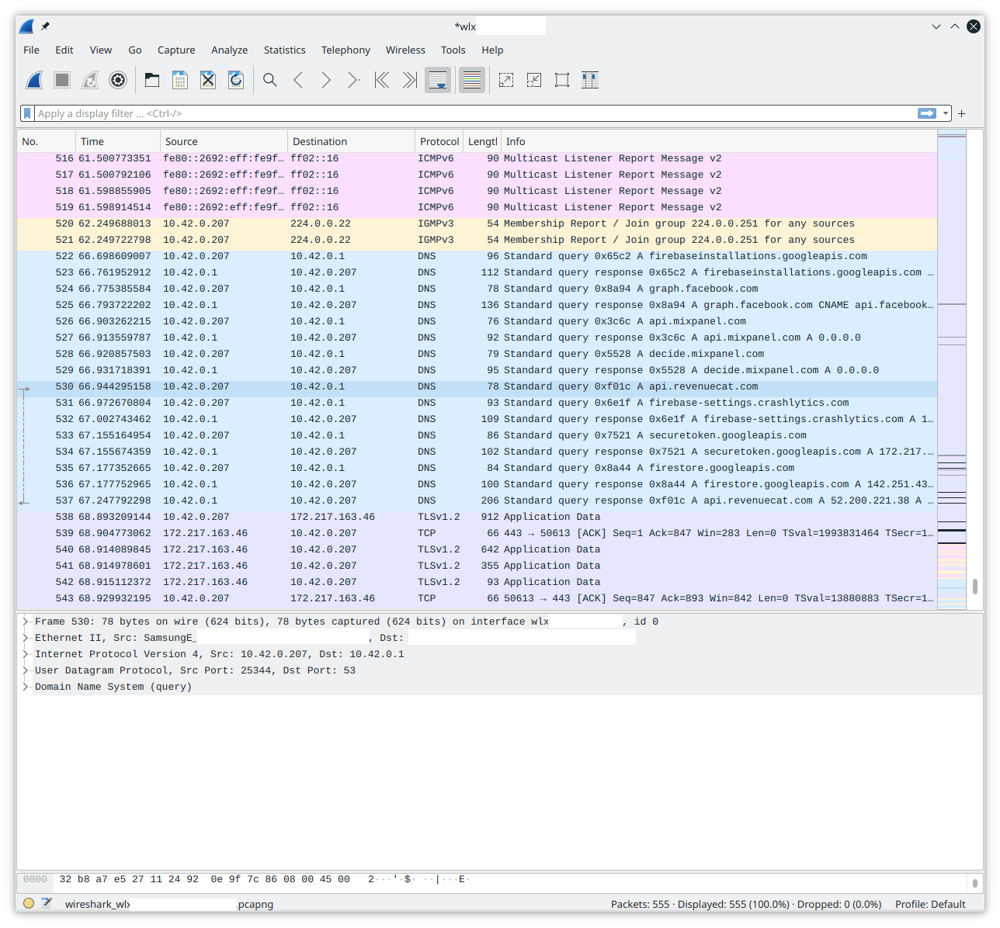

# Wireshark

### Pré-requisito

Configure o monitoramento do tráfego de rede de acordo com o artigo [Monitorar o tráfego de rede](../smartphones/network.md).&#x20;

### Utilização

O Wireshark é uma ferramenta para capturar o tráfego de rede que passa por uma interface de rede.

Durante a primeira inicialização, é necessário selecionar a interface de rede que você deseja monitorar. Essa deve ser a interface de rede que atua como ponto de acesso (AP) para o telefone. Observação: se não tiver certeza de qual é a interface, desconecte o adaptador Wifi, conecte-o novamente e verifique o `sudo dmesg` para ver o nome da interface detectada.

Quando o tráfego estiver fluindo, podemos começar a procurar atividades suspeitas.&#x20;

_NB: A interface do Wireshark não está disponível em português._

<figure><figcaption>
Um exemplo de captura do Wireshark quando um aplicativo é iniciado no telefone. 
</figcaption></figure>

### Indicadores (O que procurar?)&#x20;

#### Geral

* Domínios suspeitos. Por exemplo, `goog1e.com`
* Conexão direta com um IP sem consulta de DNS.
* Conexão periódica, por exemplo, a cada hora, sempre que o dispositivo é inicializado
* Conexão persistente
* Portas TCP e UDP incomuns
* Conexão não correlacionada com a atividade do usuário, como quando a tela do dispositivo está desligada, mas há muito tráfego de rede.

### Ameaças direcionadas

Malwares extramement furtivos tendem a ocultar seu tráfego com outros aplicativos benignos.&#x20;

### Trojans de acesso remoto (RATs)

Os RATs (do inglês _Remote Access Troj&#x61;_&#x6E;) geralmente precisam se comunicar com servidores de comando e controle (servidores C2 ou servidores C\&C) operados pelo invasor. O invasor pode emitir comandos para controlar remotamente o dispositivo infectado. Isso deve envolver muito tráfego bidirecional.&#x20;

### Spyware / stalkerware

Esses malwares geralmente não têm servidores C2, mas apenas coletam e carregam continuamente informações do usuário (como atividade do usuário no sistema, localização) para servidores de coleta.&#x20;

Adware (malware para publicidade) / mineradores de criptomoedas

Essa categoria de software é a menos intrusiva. O adware geralmente se conecta a vários sites diferentes para gerar cliques em anúncios. Os mineradores usam o poder de processamento do dispositivo para minerar criptomoedas e geralmente precisam se conectar a pools de mineração para obter resultados.&#x20;

### Referências

* Mais informações sobre análise de tráfego de rede no site da Rapid7 (em inglês): [https://www.rapid7.com/fundamentals/network-traffic-analysis/](https://www.rapid7.com/fundamentals/network-traffic-analysis/)

