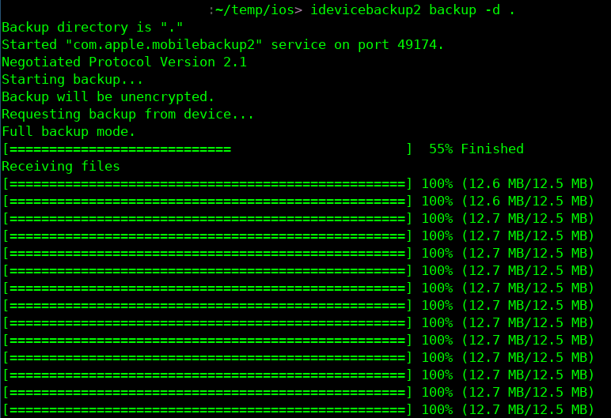

# Extrair dados para análise adicional

## Backup no iOS

* Windows: [https://support.apple.com/pt-br/guide/itunes/itns3280/windows](https://support.apple.com/pt-br/guide/itunes/itns3280/windows)
* macOS: [https://support.apple.com/pt-br/guide/iphone/iph3ecf67d29/ios](https://support.apple.com/pt-br/guide/iphone/iph3ecf67d29/ios)

## libimobiledevice

A [libimobiledevice](http://www.libimobiledevice.org/) é uma biblioteca de software multiplataforma que permite interagir com dispositivos iOS. Ela pode ser usada para realizar um backup dos dados do iPhone, o que pode fornecer dados interessantes para uma análise forense.

**Ao contrário de outras soluções apresentadas neste guia, esse backup extrairá todos os dados do usuário dos diferentes aplicativos e, portanto, contém muitas informações privadas (fotos, mensagens etc.). Esteja atento ao que você fará com ele e certifique-se de que o proprietário do dispositivo consinta com essa extração e com o que será feito com os dados.**

### Instalação

O _libimobiledevice_ tem pacotes para as distribuições OpenSUSE, Fedora, Debian e Ubuntu Linux, basta fazer **apt install libimobiledevice** (ou gerenciador de pacotes equivalente).

No MacOS, a maneira mais fácil é instalar o [gerenciador de pacotes HomeBrew](https://brew.sh/) e, em seguida, instalar o libimobiledevice com ele com **brew install ideviceinstaller**

No momento, não há uma maneira fácil de instalar a libimobiledevice no Windows; você terá de [compilá-la manualmente em seu sistema](https://github.com/libimobiledevice/libimobiledevice/issues/582/).&#x20;

No momento, não há uma maneira fácil de instalar a libimobiledevice no Windows; você terá de [compilá-la manualmente em seu sistema](https://github.com/libimobiledevice/libimobiledevice/issues/582/).&#x20;

### Extrair o backup

Depois que a libimobiledevice estiver instalada, conecte o iPhone ao computador e aceite a notificação que pergunta se o telefone deve confiar no computador conectado.

Em seguida, você pode verificar se o dispositivo está conectado corretamente ao computador com **idevice\_id -l** :

```
> idevice_id -l
6ff8a10037495eaf054018ed79fbf0e7e3c5bc2f
```

Em seguida, você pode fazer um backup do sistema com o comando **idevicebackup2 backup -d FOLDER**.



### Extrair dados em um formato legível

Os dados extraídos pelo libimobile device não estão em um formato legível; para convertê-los em dados como estão no telefone, é necessário usar outra ferramenta como o [ideviceunback](https://github.com/inflex/ideviceunback/).

Primeiro, você precisa fazer o download e instalá-la:

```
$ git clone https://github.com/inflex/ideviceunback.git
$ make
```

Agora você pode extrair os arquivos do backup:

```
./ideviceunback -v -i path/to/backup -o output/path
```
