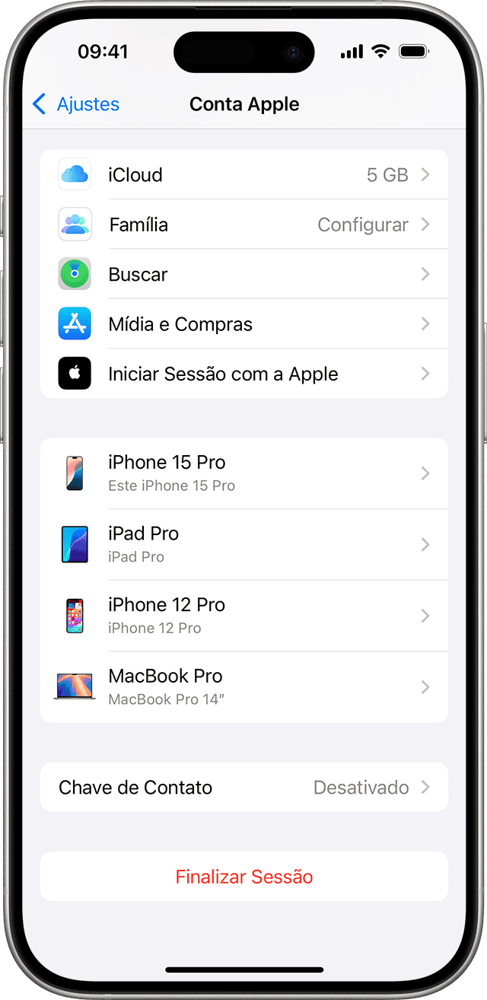

# Revisar contas do iCloud

Invasores pouco sofisticados podem monitorar a atividade de um dispositivo iOS adicionando uma conta adicional do iCloud. Normalmente, essa conta é configurada para fazer backup automático, no iCloud, de todos os dados disponíveis no telefone (como fotos, mensagens, contatos etc.). A adição de uma conta do iCloud normalmente requer acesso físico ao dispositivo. Depois que a conta do iCloud é ativada no dispositivo, os invasores podem simplesmente inspecionar os dados diretamente no iCloud ou usando um serviço externo que sincroniza com o iCloud. Por exemplo, a maioria dos serviços de stalkerware e de “controle dos pais” está adotando cada vez mais essa técnica e anunciando-a como um serviço “_No-Jailbreak_”.

Para verificar se um dispositivo iOS tem contas indesejadas no iCloud, basta abrir as _Configurações_ e procurar na parte superior do menu.

## Invasores que usam credenciais roubadas

Obviamente, se os invasores conseguiram roubar as credenciais da conta legítima do iCloud do proprietário do dispositivo, não é necessário que eles acrescentem uma conta adicional ao telefone, sem deixar rastro visível. Essa também é [uma tática comum](https://www.vice.com/en_us/article/4xpgnj/paranoid-spouses-can-spy-on-partners-ios-10-devices-with-icloud-backups). Nesse caso, uma possível verificação a ser realizada é procurar por qualquer dispositivo não reconhecido que pareça estar ativado na conta existente. [Aqui estão as instruções sobre como revisar os dispositivos conectados](https://support.apple.com/pt-br/102649)

A seguir, uma imagem da tela de configuração de um iPhone, no site da Apple.

<figure><figcaption></figcaption></figure>
