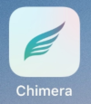

# Verificar Jailbreaks

Para instalar spyware em um dispositivo iOS, os invasores precisam explorar vulnerabilidades no sistema operacional. A Apple tornou essa tarefa significativamente mais desafiadora ao longo dos anos, tornando essas explorações mais difíceis e dispendiosas. As explorações remotas (que atacam, por exemplo, o [WhatsApp](https://www.engadget.com/2019/05/13/whatsapp-call-exploit-allowed-spyware), o iMessage ou o Safari) são particularmente raras e caras, e só podem ser acessadas por invasores com recursos, geralmente governos. No caso de um dispositivo iOS ter sido, de fato, comprometido com uma exploração privada e sofisticada de nível comercial, é provável que a única verificação que você possa realizar seja do \[tráfego de rede] de saída (../network.md).

_Jailbreaks_ , que traduzido literalmente seria algo como "escapar da prisão",  são _exploits_ para dispositivos móveis, neste caso iPhones e iPads, que normalmente são instalados manualmente no telefone e que desativam determinados recursos de segurança do iOS. [Novos jailbreaks são regularmente disponibilizados ao público](http://theiphonewiki.com/wiki/jailbreak) e os invasores podem usá-los se os dispositivos-alvo forem do modelo e da versão corretos do iOS. No momento em que este artigo foi escrito, havia jailbreaks públicos disponíveis para o iOS até a versão 14.8.

Como os usuários comuns normalmente não instalam (e não devem instalar) jailbreaks em seus iPhones e iPads, se o dispositivo que você está testando mostrar que tem jailbreak, isso é um sinal confiável de um possível comprometimento. Veja a seguir alguns dos rastros que podem ser deixados por um jailbreak público.

## Procure ícones de aplicativos relacionados ao jailbreak

Durante o processo de jailbreak do telefone, vários aplicativos são frequentemente instalados, seja para fazer o jailbreak do celular (como [checkra1n](https://checkra.in/), [unc0ver](https://github.com/pwn20wndstuff/Undecimus) ou [Chimera](https://chimera.sh/)) ou para instalar aplicativos (como [Cydia](https://cydia.saurik.com/) ou [Sileo](https://getsileo.app/)). A primeira etapa para identificar um iPhone com jailbreak é verificar se há um desses aplicativos no telefone:

| App      | Logo                                      |
| -------- | ----------------------------------------- |
| Cydia    |     |
| Sileo    |     |
| unc0ver  |  |
| Chrimera |  |
| Electra  |   |

## Verificar se há portas abertas no telefone

Muitas ferramentas de jailbreak instalam um servidor SSH por padrão durante a operação. Assim, é possível detectar se o servidor está em execução ao verificar as portas abertas no iPhone a partir de outro computador na mesma rede.

Para fazer isso, primeiro você precisa obter o endereço IP do iPhone. Vá para Configurações > Wifi > Sua rede e obtenha o valor no campo “Endereço IP” (algo como 192.168.0.1).

Em outro computador na mesma rede, você precisa usar um scanner de portas, como o [nmap](https://nmap.org/), e verificar as portas do iPhone. Por exemplo, com o nmap por meio da linha de comando :

```
## nmap 192.168.186.196
Starting Nmap 7.70 ( https://nmap.org ) at 2019-11-07 00:07 CET
Nmap scan report for iPhoneRobert.lan (192.168.186.196)
Host is up (0.0041s latency).
Not shown: 998 closed ports
PORT      STATE SERVICE
22/tcp    open  ssh
62078/tcp open  iphone-sync

Nmap done: 1 IP address (1 host up) scanned in 41.18 seconds
```

Nessa varredura, vemos que o SSH está sendo executado na porta 22 (sua porta padrão), o que significa que o iPhone está desbloqueado.

## Tente montar o sistema de arquivos completo

Em muitos casos, o jailbreak do dispositivo também instala, por padrão, o serviço AFC2 que permite montar o sistema de arquivos raiz a partir de um computador externo conectado por USB. Você pode testar se o sistema de arquivos raiz do iPhone pode ser montado usando a ferramenta [ifuse](https://github.com/libimobiledevice/ifuse).

Primeiro, é necessário fazer download do código-fonte e instalá-lo em seu sistema Linux ou MacOSX, conforme explicado em [nesta página](https://github.com/libimobiledevice/ifuse/wiki/).

Depois de instalado, é preciso aceitar que o telefone confie no computador e possa, simplesmente, executar `ifuse --root FOLDER.`

Se o telefone estiver desbloqueado com o serviço AFC2 em execução, o sistema de arquivos raiz será montado diretamente na pasta fornecida:

```
> ifuse --root mount/
> ls mount
Applications  boot   dev        etc  lib      mnt      sbin    tmp   usr
bin           cores  Developer  jb   Library  private  System  User  var
```

Se o telefone não estiver desbloqueado ou se o AFC2 não estiver sendo executado nele, você verá a seguinte mensagem de erro:

```
> ifuse --root mount/
Failed to start AFC service 'com.apple.afc2' on the device.
This service enables access to the root filesystem of your device.
Your device needs to be jailbroken and have the AFC2 service installed.
```
