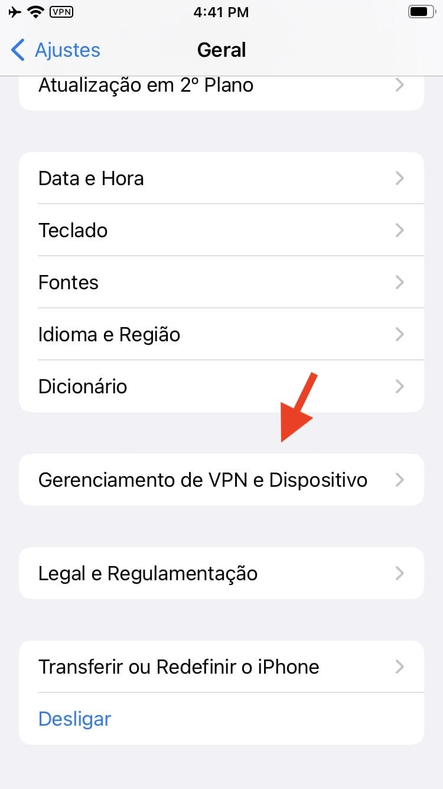
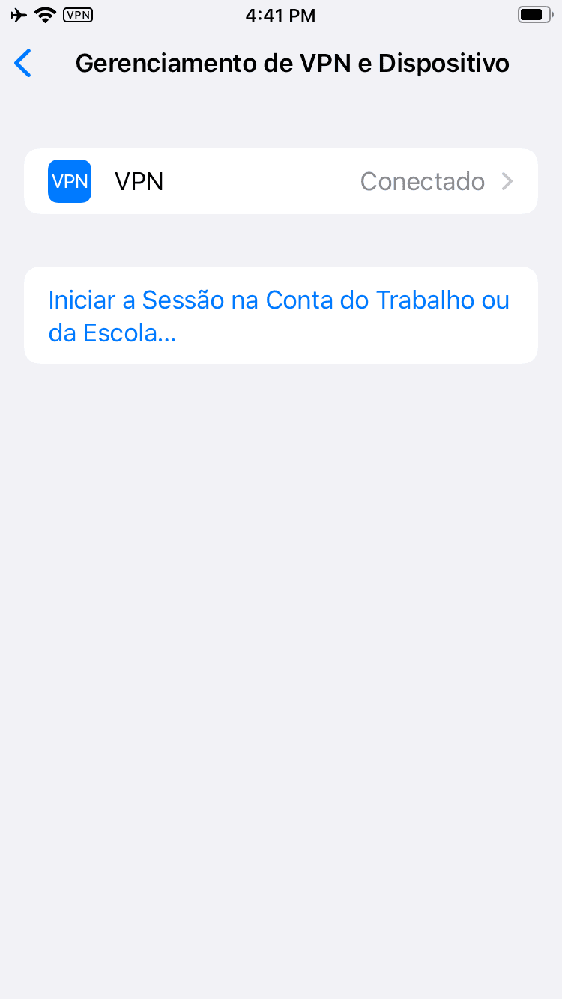

# Verificar perfis de gerenciamento de dispositivos móveis

O Mobile Device Management (MDM) é um sistema comumente usado pelas empresas para controlar uma frota de dispositivos móveis e poder, por exemplo, emitir atualizações de configuração, instalar aplicativos ou limpar remotamente os dados em caso de perda do dispositivo. [Os atacantes às vezes são vistos abusando do MDM](https://blog.talosintelligence.com/2018/07/Mobile-Malware-Campaign-uses-Malicious-MDM.html) para manter o controle sobre os telefones de suas vítimas e instalar aplicativos mal-intencionados.

O processo de registro, normalmente, requer alguma interação manual. Uma infecção pode ocorrer, por exemplo, se os invasores conseguirem obter acesso físico ao dispositivo (mesmo que por um curto período) ou por meio de engenharia social das vítimas para que elas se registrem.

Da mesma forma que as [contas do iCloud mal-intencionadas](icloud.md) os perfis MDM devem estar visíveis nas configurações do dispositivo. Se um perfil MDM estiver instalado no dispositivo, a abertura de “_Configurações_” e, em seguida, “_Geral_”, deverá revelar uma opção de menu Perfil ou Gerenciamento de VPN e Dispositivo, ou Gerenciamento de Dispositivo.

<figure><figcaption></figcaption></figure>

<figure><figcaption></figcaption></figure>

Se o proprietário do dispositivo não reconhecer o perfil MDM e se o perfil MDM não parecer pertencer a uma organização ou empresa com a qual o proprietário do dispositivo trabalha, é possível que o dispositivo tenha sido comprometido.
