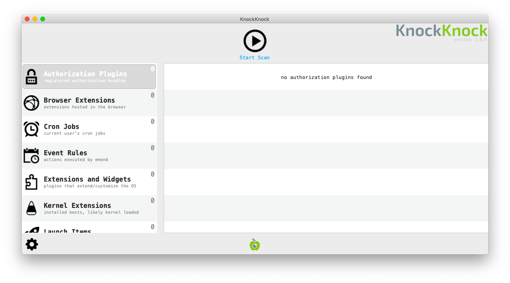
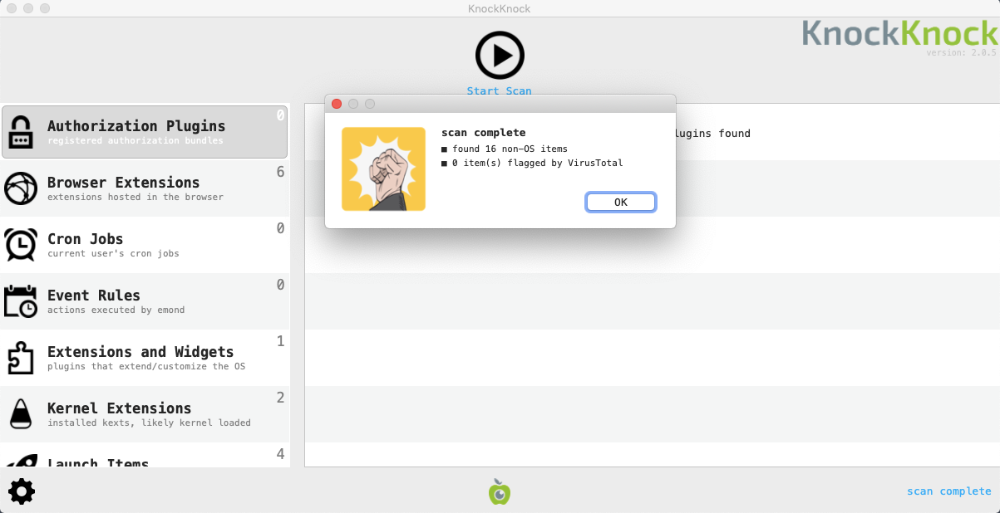
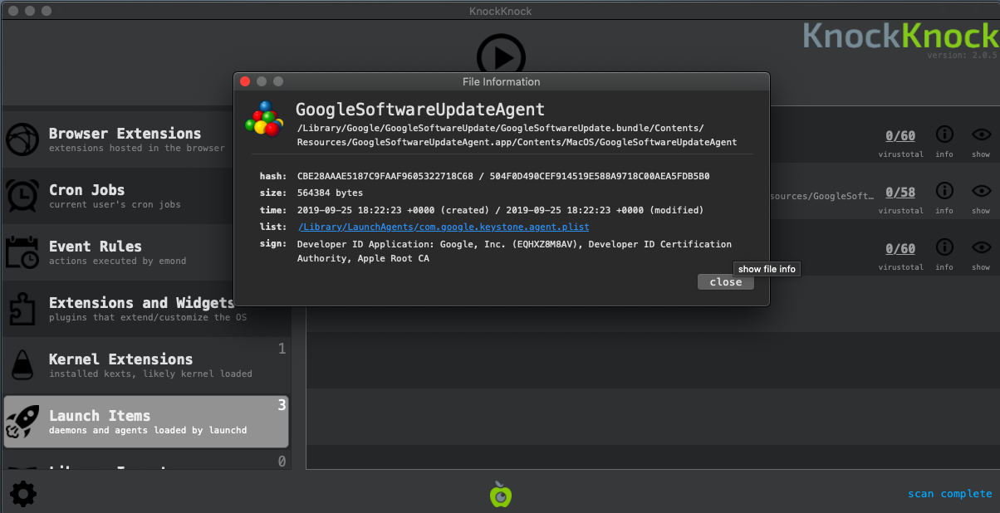

# Revisar programas abertos na inicialização

A maioria dos _spywares_ precisa encontrar uma maneira de ser executada na inicialização quando o computador é reiniciado. Portanto, é interessante revisar a lista de programas executados na inicialização para identificar possíveis malwares. O programa [KnockKnock](https://objective-see.com/products/knockknock.html) desenvolvido pela Objective-See permite listar esses programas.

## Como iniciar o KnockKnock

Primeiro, é necessário fazer o download do programa em [sua página oficial](https://objective-see.com/products/knockknock.html) depois descompactar o arquivo que contém o programa (clicar duas vezes nele deve funcionar na maioria dos casos) e clicar duas vezes no programa KnockKnock para iniciá-lo.

_NB: a interface do KnockKnock não está disponível em português._

Uma vez iniciado, você precisa pressionar o botão `Start Scan`. O KnockKnock fará a varredura dos locais conhecidos onde um software persistente ou malware possa estar instalado e verificará se eles são conhecidos pelo [VirusTotal](https://www.virustotal.com/).

## Análise de resultados

O KnockKnock não determina automaticamente quais programas são mal-intencionados ou não. Assim como no restante desta [metodologia](../methodology.md), é necessário que você se familiarize o suficiente com seus resultados para identificar rapidamente quaisquer anomalias ou entradas que não reconheça. Também é importante que você converse com o proprietário do sistema para identificar quais programas são desconhecidos para ele.

Veja a seguir algumas sugestões de padrões a serem observados.

### 1. Verifique as assinaturas dos aplicativos (_image signature_)

**Nota:** no contexto de detecção e análise de malware. Image pode significar imagem de disco de instalação de um aplicativo (_disk image_), ou a representação binária do executável do aplicativo já instalado. &#x20;

Nas versões modernas do macOS, os aplicativos legítimos geralmente precisam ser “assinados” com um certificado de desenvolvedor. Esses certificados permitem verificar quem é o produtor de um determinado programa (como Google, Adobe ou outro). Os aplicativos que não são assinados normalmente são mais controlados e examinados pelos mecanismos de segurança do macOS. Uma primeira verificação útil é checar se um aplicativo está assinado ou não. Para visualizar a assinatura do aplicativo, clique no ícone `(!) Info` à direita do nome do aplicativo. Observe que, por padrão, os programas assinados pela Apple são filtrados.

### 2. Verifique os nomes e os caminhos dos programas

O KnockKnock mostra o nome que foi dado ao aplicativo por seus desenvolvedores. Essas informações podem ser falsificadas, mas, às vezes, os invasores são preguiçosos o suficiente para escrever incorretamente nomes legítimos falsificados (por exemplo, “Micorsoft Ofice” ou “Crhome”) ou simplesmente deixar caracteres e números aleatórios.

Os aplicativos do macOS geralmente são instalados em algumas pastas, dependendo do tipo de aplicativo. O fato de um aplicativo ser executado na inicialização a partir de uma pasta não padrão não significa que ele seja mal-intencionado, mas é definitivamente suspeito e deve ser verificado mais detalhadamente.

Aqui estão as pastas padrão:

* Extensões de navegador normalmente são executadas em `/Usuários/<nome de usuário>/Biblioteca/Application Support.`Na versão em inglês: `/Users/<username>/Library/Application Support`
* Extensões do kernel: `/Biblioteca/Extensions` ou `/Sistema/Biblioteca/Extensions/`. Na versão em inglês: `/Library/Extensions` ou `/System/Library/Extensions/`
* Outros aplicativos: `Biblioteca` e `Aplicativos`. Na versão em inglês: `Library` e `Applications`&#x20;

### 3. Checar os resultados da verificação do VirusTotal

Durante a verificação, o KnockKnock checa a impressão digital dos aplicativos executados na inicialização no banco de dados do [VirusTotal](https://virustotal.com/) e mostra o resultado no menu.

Qualquer arquivo identificado como mal-intencionado por pelo menos um antivírus, no VirusTotal, deve ser verificado (embora haja alguns falsos positivos, tenha isso em mente se apenas um número muito pequeno de antivírus estiver detectando-o como mal-intencionado). Um arquivo não conhecido pelo VirusTotal também é suspeito, pois seu banco de dados contém os aplicativos legítimos mais comuns.

**Observação:** conforme [discutido em Segurança](../safety.md), em circunstâncias normais, você deve desconectar da Internet o computador que está sendo testado. Sem uma conexão com a Internet, não é possível fazer uma verificação imediata com o VirusTotal. No entanto, é possível salvar os resultados do KnockKnock clicando em _Configurações_ > _Salvar resultados da verificação_ e, posteriormente, abrir os resultados em um computador separado com conexão à Internet.
