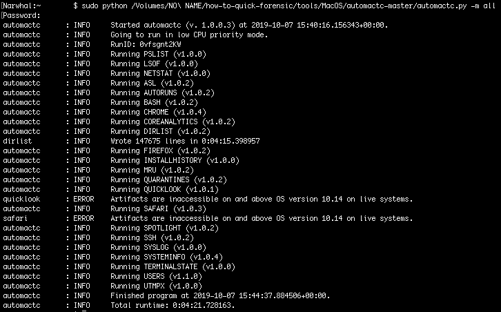

# Extrair dados para análise adicional

Se você não encontrou nada suspeito no sistema, mas deseja investigar mais a fundo quando estiver sem acesso ao sistema, é possível coletar dados forenses interessantes para analisá-los posteriormente usando o [AutoMacTC](https://www.crowdstrike.com/blog/automating-mac-forensic-triage/).

Observação importante:

* Esse programa pode extrair algumas informações privadas (como o histórico do navegador), portanto, tenha isso em mente ao usá-lo.
* Este programa não é atualizado desde 2021, sendo compatível apenas até o macOS 11.

## Como iniciar o AutoMacTC

Primeiro, você precisa baixar o AutoMacTC do [repositório do Github](https://github.com/CrowdStrike/automactc/archive/master.zip) e extraí-lo.

Em seguida, é necessário iniciar um terminal, no menu > `Other` > `Terminal`. Para executar o programa, você precisa saber o caminho do código AutoMacTC extraído e executar `sudo python <PATH>/automactc-master/automactc.py -m all`.

A execução desse comando com o argumento `-m all` extrairá todos os dados disponíveis. Também é possível extrair dados mais específicos passando o nome de um módulo específico. Aqui está a lista de módulos da [documentação do AutoMacTC](https://www.crowdstrike.com/blog/automating-mac-forensic-triage/) :

* pslist: lista de processos atuais no momento da execução do AutoMacTC
* lsof: identificadores de arquivos atuais abertos no momento da execução do AutoMacTC
* netstat: conexões de rede atuais no momento da execução do AutoMacTC
* asl: arquivos de registro do sistema Apple (.asl) analisados
* autoruns: análise de vários locais de persistência e listas
* bash: análise de arquivos `bash/.*_history` para todos os usuários
* chrome: análise do histórico de visitas e do histórico de downloads do Chrome
* coreanalytics: análise de evidências de execução de programas produzidas pelo diagnóstico da Apple
* dirlist: lista de arquivos e diretórios no disco
* firefox : análise do histórico de visitas e de downloads do Firefox
* installhistory: análise do histórico de instalação do programa
* mru : análise de arquivos plist SFL e MRU
* quarantines : análise do banco de dados QuarantineEventsV2
* quicklook : análise do banco de dados Quicklooks
* safari : análise do histórico de visitas e de downloads do Safari
* spotlight : análise das principais pesquisas do usuário no Spotlight
* ssh: análise dos arquivos known\_hosts e authorized\_keys de cada usuário
* syslog: análise de arquivos system.log
* systeminfo : identificação básica do sistema, como endereço IP atual, número de série, nome do host
* users : listagem de usuários presentes e excluídos no sistema
* utmpx: listagem de sessões de usuário em terminais

## Dados extraídos

Todos os dados extraídos são salvos em um arquivo chamado `automactc-output,<computername>,<ipaddress>,<date>.tar.gz`. Ele contém arquivos csv com resultados de todos os módulos executados.
