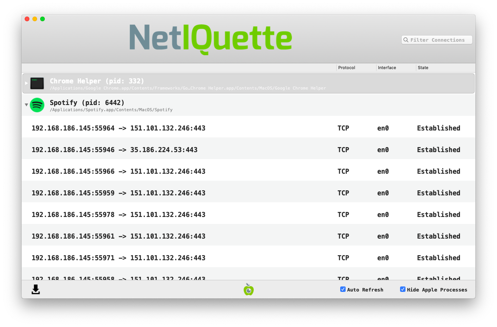

# Revisar conexões de rede

O spyware precisará eventualmente transmitir os dados coletados (como capturas de tela, senhas, pressionamentos de teclas etc.) para um local remoto, o [servidor Command & Control.](https://web.archive.org/web/20221208140438/https://securitywithoutborders.org/resources/digital-security-glossary.html#cnc/) Embora não seja possível prever quando essa transmissão ocorrerá, é possível que algum spyware estabeleça uma conexão permanente com o servidor ou que se conecte com frequência suficiente para que você o detecte.

Para verificar se há conexões em andamento, você pode, por exemplo, registrar todo o tráfego de rede usando o [Wireshark](https://www.wireshark.org/) e, posteriormente, inspecionar os resultados armazenados. Entretanto, uma abordagem mais interessante é usar ferramentas que não apenas monitorem a atividade da rede, mas que também possam vinculá-la aos processos em execução. Em geral, você deve procurar processos incomuns que se conectem a endereços IP suspeitos.

Uma ferramenta popular para fazer isso é o [Netiquette](https://objective-see.com/products/netiquette.html), desenvolvido pela Objective-See.

_NB: a interface do NetIQuete não está disponível em português._

A ferramenta é bastante simples: ela lista todas as conexões de rede estabelecidas e fornece informações sobre o processo de origem e o destino. Você provavelmente ficará surpreso ao observar a quantidade de conexões de rede ativas mesmo em sistemas aparentemente ociosos. A primeira etapa da pesquisa de conexões de rede suspeitas é fechar todos os aplicativos em execução no sistema que não sejam necessários no momento, pois isso removerá alguns ruídos durante a análise.

Em seguida, examine os aplicativos um a um e avalie se é legítimo que eles se comuniquem com a rede. Se for, observe as diferentes conexões desse processo para ver se parecem legítimas. Você deve ter em mente algumas informações sobre endereços de rede:

* `127.0.0.1` é o endereço do _localhost_ (servidor local); qualquer conexão com ele significa que o programa está falando com o próprio computador, portanto, é legítimo.
* Os endereços IP que começam com`192.168.` or `10.`são endereços privados, que pertencem ao seu computador ou a um computador em sua própria rede privada.

Para obter mais informações sobre um endereço IP, você pode usar as ferramentas online [CentralOps](https://centralops.net/co/) ou [IPinfo](https://ipinfo.io/). Elas informarão a qual rede um IP pertence, mas talvez não forneçam o usuário real de um endereço IP, portanto, você terá que desenvolver uma noção do que é normal em uma rede ou não.

Por exemplo, na captura de tela acima, vemos uma conexão do processo do Spotify com o endereço `151.101.132.246.`Verificando no CentralOps, vemos que esse endereço IP pertence à organização Fastly, um provedor de nuvem americano usado por muitas empresas, como o Spotify, na função de Rede de Fornecimento de Conteúdo ([Content Delivery Network](https://en.wikipedia.org/wiki/Content_delivery_network) ou CDN), portanto, trata-se de uma conexão legítima.

