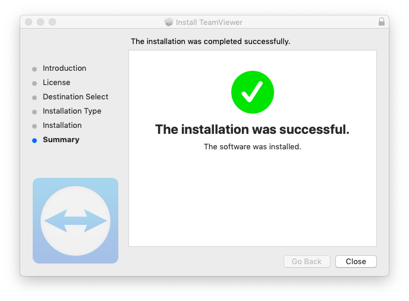
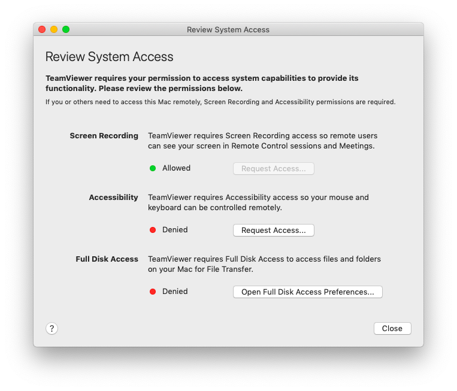
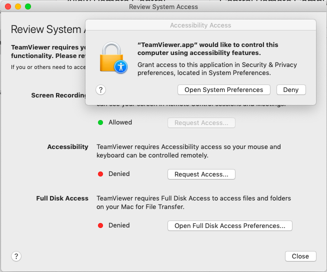
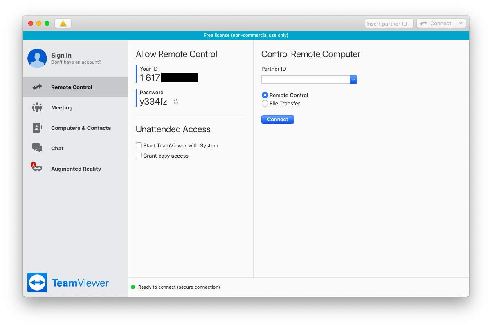
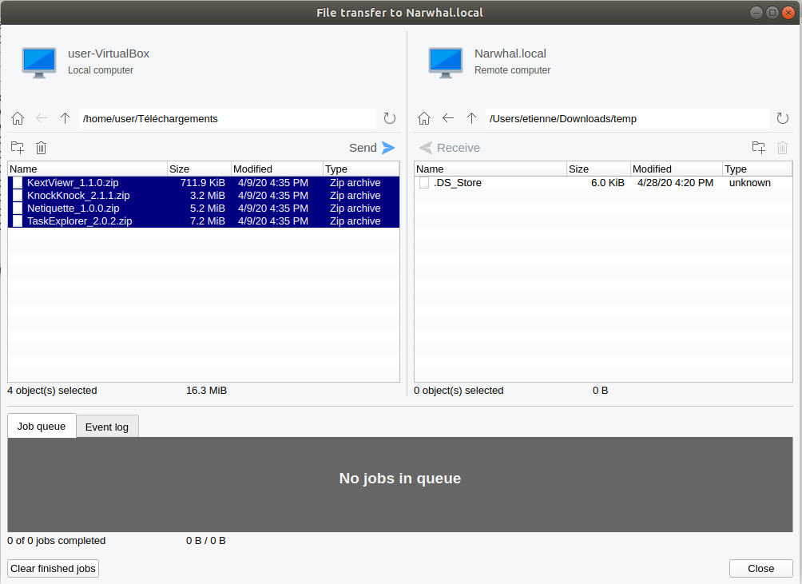

# Computadores Mac

## Pedindo ao usuário para instalar o Teamviewer

### Instalando o Teamviewer

O usuário deve primeiro fazer o download do cliente [Teamviewer para MacOs](https://www.teamviewer.com/pt/download/mac-os/). Quando o arquivo `.dmg` for baixado, deve clicar duas vezes nele e, em seguida, clicar duas vezes no ícone mostrado na tela para iniciar o processo de instalação.

<figure><figcaption></figcaption></figure>

O processo de instalação é bastante simples, é preciso aceitar a licença e, em seguida, instalar o TeamViewer no computador.

No final do processo de instalação, o TeamViewer inicia o assistente para configurar os direitos de acesso no sistema. Pode-se pular essa parte.

### Concedendo acesso total ao Teamviewer

Depois de instalado, o usuário deverá ver a janela do TeamViewer. Agora é preciso configurar os direitos de acesso. Quando este arquivo foi escrito, era necessário ir até `Help > Check system access`.

Para cada uma dessas etapas, o cliente precisa clicar em “Request Access” (Solicitar acesso), que abre a janela de configuração do sistema relevante e permite que você adicione o TeamViewer a ela. Para cada uma delas, será necessário primeiro clicar no ícone de cadeado na parte inferior esquerda da janela para obter o direito de administrador e, em seguida, adicionar o TeamViewer à lista de aplicativos autorizados.

Depois de executar todas as etapas, deverá ver as três configurações do sistema com um ponto verde escrito “Permitido”. Agora, poderá sair do TeamViewer e iniciá-lo quando necessário.

## Conexão com o computador do usuário

Para se conectar ao computador do usuário, é necessário pedir que ele forneça sua ID (um número de 10 dígitos) e uma senha (uma sequência de seis caracteres, incluindo letras e números). Digite o ID do usuário na parte `Control Remote Computer` e digite a senha quando solicitado.

### Transferindo arquivos

Agora você deve ter o Teamviewer conectado. A primeira etapa é copiar todos os programas necessários para esta verificação usando a ferramenta Transferência de arquivos. Vá até a barra de navegação na parte superior e clique em `Open File Transfer` em `Files & Extras`. Você deve criar uma pasta temporária e, em seguida, transferir todos os programas necessários de seu computador, selecionando-os e clicando em `Send`.

### Verificando o computador

Depois que todos os programas forem transferidos, prossiga com as verificações padrão, conforme descrito na parte MacOS deste guia. Lembre-se de que a conexão pode estar lenta e pode levar mais tempo do que o normal.

## Desinstalação do TeamViewer

Uma vez concluída a verificação, o usuário deve desinstalar o TeamViewer. Para isso, é necessário abrir o aplicativo, ir para a página `TeamViewer > Preferências`, ir para a guia `Avançado` e ir para a parte inferior da página na `Seção de desinstalação`. Clique em `Also delete configuration files` e clique em Uninstall.

