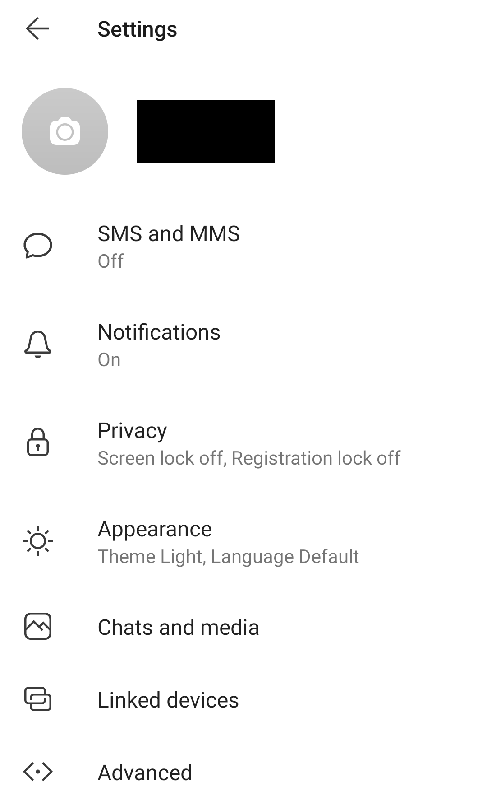
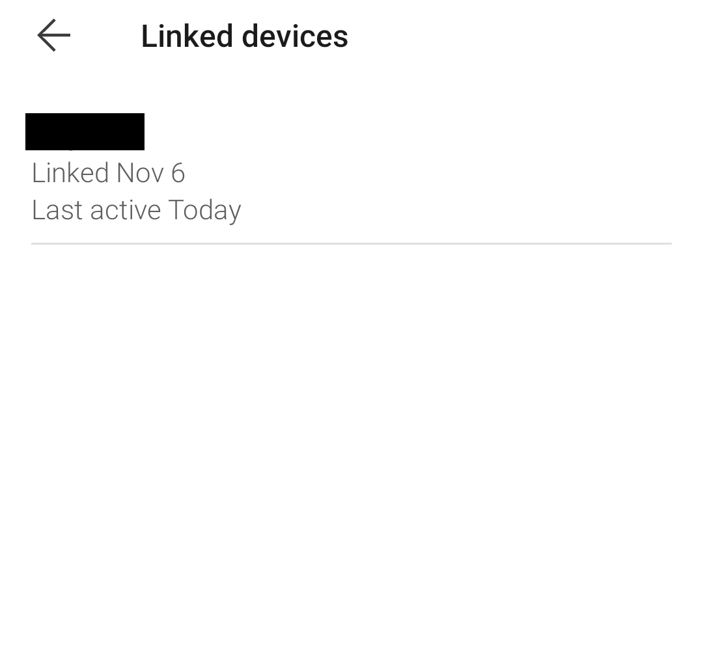
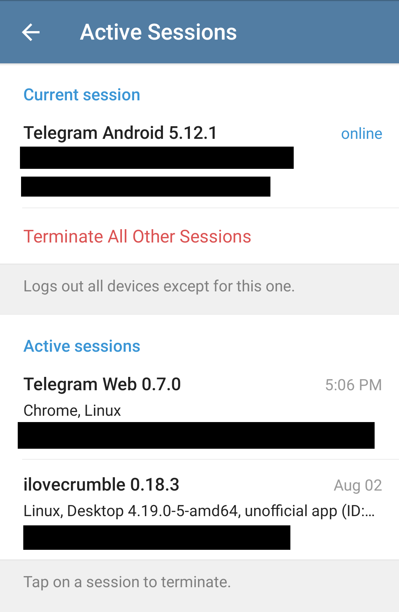

# Verificar dispositivos vinculados a aplicativos de bate-papo

Muitos aplicativos de bate-papo permitem vincular outro dispositivo à conta para ler e enviar mensagens de um computador. É possível usar esse recurso para obter acesso ilegítimo à conta e às mensagens trocadas pelo aplicativo. Portanto, é interessante verificar se não há nenhuma sessão desconhecida ou dispositivos vinculados.

## Signal

Vá para a página “Linked Devices” (Dispositivos vinculados) em Parameters (Parâmetros) (`...` no menu) > Settings (Configurações). Você verá uma lista de dispositivos conectados. Você pode tocar em qualquer dispositivo desconhecido para desconectá-lo.

 

## WhatsApp

Vá para Parameters (`...` no menu) e clique em “WhatsApp Web”.

Você pode ver aqui todos os navegadores da Web conectados à sua conta do WhatsApp.

## Telegram

Em seu aplicativo Telegram, visite a página Configurações > Privacidade e segurança > Sessões ativas. Essa página mostra todas as sessões ativas que você tem na sua conta. Você pode tocar em qualquer sessão para encerrá-la.

## Wire

No aplicativo Wire, clique em seu perfil e vá para `Configurações > Dispositivos`. Nessa página, você pode ver todas as sessões abertas para a sua conta, incluindo aplicativos de smartphone, aplicativos de desktop e sessões da Web. Você pode clicar em qualquer uma dessas sessões e remover o dispositivo (você precisará da sua senha para fazer isso).

