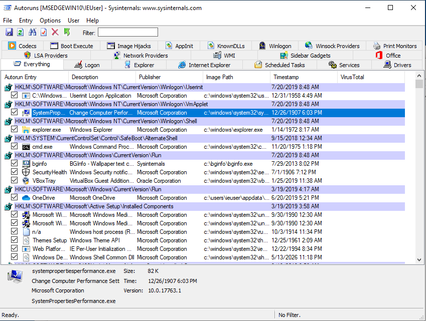
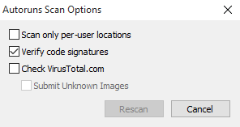

# Revisão de programas abertos na inicialização

Normalmente, o _spyware_ precisa encontrar uma maneira de ser executado quando o computador é reiniciado. Portanto, analisar os aplicativos que são iniciados automaticamente é um dos primeiros passos na busca de possíveis infecções. Os computadores com Windows têm diferentes maneiras de ativar a inicialização automática, e o _spyware_ geralmente usa artifícios para parecer legítimo e/ou evitar os métodos mais comuns.

O [Sysinternals Autoruns](https://technet.microsoft.com/en-ca/sysinternals/bb963902.aspx/) é uma ferramenta que permite listar detalhadamente os programas executados na inicialização. Se possível, você deve executar esse programa como Administrador:

_NB: a interface do Autoruns está disponível em Inglês apenas._

Todos os resultados serão exibidos por padrão na guia principal. Ao clicar nas outras guias disponíveis, os resultados serão filtrados pelo respectivo tipo de inicialização automática. Em geral, os mais interessantes seriam `Logon`, `Tarefas Agendadas (Scheluded`&#x20;

`Tasks)`, `Serviços (Services)`.

## Procurando por padrões suspeitos

O Autoruns não determina automaticamente para você quais arquivos são maliciosos e quais não são. Como no restante desta metodologia, é necessário que você se familiarize o suficiente com os resultados para identificar rapidamente quaisquer anomalias ou entradas que não reconheça. Entretanto, o Autoruns pode fornecer algumas indicações úteis.

Às vezes, o Autoruns pode marcar uma determinada linha com um fundo vermelho. Isso pode justificar uma inspeção mais detalhada, pois pode ser um sinal de uma entrada incomum. No entanto, as entradas marcadas com um fundo amarelo referem-se a arquivos que não existem mais no computador. Portanto, essas entradas estão quebradas.

Veja, a seguir, algumas sugestões de padrões a serem observados.

### 1. Verificar assinaturas de imagem

Nas versões modernas do Windows, os aplicativos legítimos geralmente precisam ser “assinados” com um certificado de desenvolvedor. Esses certificados permitem verificar o produtor de um determinado programa (como Microsoft, Google, Adobe ou outro). Os aplicativos que não são assinados normalmente são mais controlados e examinados pelos mecanismos de segurança do Windows (como o antivírus incorporado, o Windows Defender). Uma primeira verificação útil é verificar se todos os aplicativos iniciados automaticamente estão de fato assinados, e isso pode ser feito clicando em _Opções_ > _Opções de verificação_ e ativando _Verificar assinaturas de código_.

Isso reiniciará a verificação do Autoruns e adicionará uma nova coluna chamada “Publisher”. Os aplicativos assinados corretamente serão marcados como “(Verificado)”:

**Cuidado**: Nem todas as entradas de execução automática verificadas são necessariamente seguras. Às vezes, os invasores abusam propositalmente de aplicativos verificados legítimos para parecerem menos suspeitos e os usam como iniciadores para carregar e executar códigos mal-intencionados. Isso, às vezes, é feito usando, por exemplo, o Microsoft `rundll32.exe` ou outros aplicativos afetados pelo que é conhecido como [DLL Sideloading](https://attack.mitre.org/techniques/T1574/002/).

### 2. Verifique o nome da entrada de execução automática

A entrada de execução automática mostra o nome que foi dado ao aplicativo pelos seus desenvolvedores. Essas informações podem ser impostoras, mas, às vezes, os invasores são preguiçosos o suficiente para escrever incorretamente os nomes legítimos falsificados (por exemplo, “Micorsoft Ofice” ou “Crhome”) ou simplesmente deixar caracteres e números aleatórios.

### 3. Verifique a descrição do programa

Da mesma forma, esse não é um indicador confiável, mas os aplicativos legítimos geralmente devem ter uma descrição do programa visível.

### 4. Verifique o caminho da imagem

O Windows fornece algumas pastas padrão nas quais os aplicativos legítimos são normalmente instalados e executados. Os serviços do próprio sistema operacional normalmente estão localizados em `C:\Windows\`, enquanto os aplicativos instalados pela usuária geralmente estão localizados em `C:\Program Files\` ou `C:\Program Files (x86)\`. Como a instalação de programas nessas pastas deve exigir alguma confirmação da usuária, os atacantes geralmente colocam seus arquivos maliciosos em pastas menos comuns, como `C:\Users\<Username>\AppData\` ou outras subpastas em `C:\Users\`.

Exemplo de entradas suspeitas:

* O spyware [KeyBoy](https://citizenlab.ca/2016/11/parliament-keyboy/) cria uma chave de registro em `HKEY_CURRENT_USER\SOFTWARE\Microsoft\Windows NT\CurrentVersion\Winlogon\shell` com o valor `explorer.exe,C:\Windows\system32\rundll32.exe “%LOCALAPPDATA%\cfs.dal” cfsUpdate`
* Um malware específico usado na Ásia Central se baseia no uso de VBScripts, que são destacados pelo Autoruns com um fundo vermelho, fingindo ser software da Adobe e do Google. Esses resultados definitivamente justificariam uma inspeção mais detalhada. Além disso, os scripts estão localizados em `C:\Users\<Username>\AppData\`:

### 5. Procurando programas no VirusTotal (Opcional)

Opcionalmente, o Autoruns permite verificar arquivos binários no [VirusTotal](https://www.virustotal.com/gui/home/upload/), o que ajuda a identificar imediatamente qualquer programa malicioso que seja bem conhecido e amplamente detectado pelo software antivírus (leia mais sobre isso na seção abaixo). Para ativar essa verificação, vá para _Options_ > _Scan Options_ e ative “_Check VirusTotal.com_”. Tenha cuidado para não ativar “_Submit Unknown Files_”, pois isso faria com que o Autoruns enviasse automaticamente os arquivos locais para o serviço, em vez de apenas procurar seus _hashes_ criptográficos. VirusTotal é uma empresa que fornece acesso comercial dos seus dados para pesquisadoras de segurança e clientes em todo o mundo. Agora, ela pertence à Alphabet (empresa controladora do Google). As usuárias dos serviços comerciais da VirusTotal podem pesquisar e baixar qualquer arquivo carregado. Portanto, convém evitar o envio inadvertido de arquivos confidenciais.

<figure><figcaption></figcaption></figure>

Quando a opção VirusTotal estiver ativada, levará algum tempo para que os resultados apareçam. Eventualmente, você verá uma coluna, nomeada como VirusTotal, exibindo os resultados da verificação do Antivírus. Os resultados aparecem como um valor _X/Y_, em que _X_ é o número de detecções positivas e _Y_ é a quantidade total de software antivírus com o qual o arquivo foi verificado.&#x20;

<figure><figcaption></figcaption></figure>

Se nenhum resultado for exibido, isso significa que esse programa específico não foi carregado anteriormente no VirusTotal e pode justificar uma inspeção adicional. Às vezes, você verá alguns aplicativos com um número de detecção baixo (1 ou 2): geralmente esses são falsos positivos. Os resultados do VirusTotal que mostram um número de detecção mais alto (por exemplo, 5 ou mais) geralmente são um sinal confiável de que esse aplicativo específico é mal-intencionado. Clique no link do X/Y para abrir o navegador e começar uma análise do VirusTotal, onde você poderá ver mais detalhes, como quaisquer identificadores de malware usados pelo programas antivírus da lista do VirusTotal.

**Observação:** conforme [discutido em Segurança](../safety.md), em circunstâncias normais, é preferível não conectar o computador sendo testado à Internet. Mas sem uma conexão com a Internet, não é possível fazer uma verificação imediata com o VirusTotal. No entanto, é possível salvar os resultados do Autoruns clicando em Arquivo > Salvar... e, posteriormente, abrir os resultados em um computador separado com conexão à Internet.
