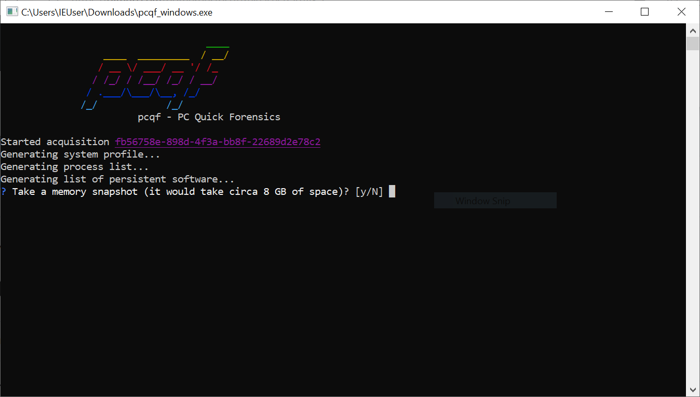

# Extrair dados para análise adicional

O [pcqf](https://github.com/botherder/pcqf) é uma ferramenta que permite fazer uma descarga (_dump_) das informações de inicialização e processos reais, juntamente com a memória para análise posterior. Ela é realmente útil, por exemplo, se você não tiver tempo para verificar tudo no computador e quiser verificar novamente se há algo suspeito mais tarde. Você deve executar esse programa a partir de uma chave USB com espaço de armazenamento suficiente, clicar duas vezes no arquivo binário e seguir as instruções.

A menos que você tenha um bom motivo para fazer isso, é recomendável não tirar um instantâneo da memória, pois ele contém muitas informações privadas (pode conter senhas, por exemplo).

Uma vez concluído, ele criará uma pasta nomeada pelo ID da aquisição (uma sequência de números hexadecimais), que contém:

* Um arquivo `profile.json` que contém informações básicas sobre o sistema do computador.
* Um arquivo `process_list.json` que contém uma lista de processos em execução.
* Um arquivo `autoruns.json` que contém uma lista de todos os itens com persistência no sistema.
* Uma pasta `autoruns_bins/` que contém cópias dos arquivos e executáveis marcados para persistência no arquivo JSON anterior.
* Uma pasta `process_bins/` que contém cópias dos processos em execução.
* Se solicitado, uma pasta `memory/` conterá um despejo de memória física, bem como alguns metadados.
