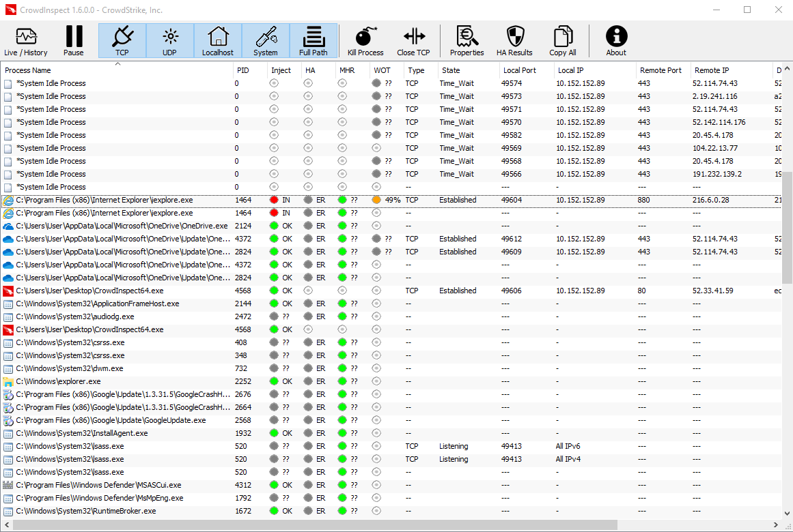

# Revisar conexões de rede

O spyware precisará eventualmente transmitir os dados coletados (como capturas de tela, senhas, pressionamento de teclas, etc.) para um local remoto, o [servidor de Comando e Controle](https://www.crowdstrike.com/cybersecurity-101/cyberattacks/command-and-control/), também conhecido como C\&C. Embora não seja possível prever quando essa transmissão ocorrerá, é possível que algum spyware estabeleça uma conexão permanente com o servidor ou que se conecte com frequência suficiente para que você o detecte.

Para verificar se há conexões em andamento, você pode, por exemplo, registrar todo o tráfego de rede usando o [Wireshark](https://www.wireshark.org/) e, posteriormente, inspecionar os resultados armazenados. Entretanto, uma abordagem mais interessante é usar ferramentas que não apenas monitorem a atividade da rede, mas que também possam vinculá-la aos processos em execução. Em geral, você deve procurar processos incomuns que se conectem a endereços IP suspeitos.

Uma ferramenta popular para fazer isso é o [TCPView](https://technet.microsoft.com/en-us/sysinternals/tcpview.aspx), também do Sysinternals Suite da Microsoft.


_NB: a interface do TCPView está disponível em Inglês apenas._

A ferramenta é bastante simples: ela lista todas as conexões de rede estabelecidas e fornece informações sobre o processo de origem e o destino. Você provavelmente ficará surpreso ao observar a quantidade de conexões de rede ativas, mesmo em sistemas aparentemente ociosos. Na maioria das vezes, você verá atividade de rede de processos em segundo plano, por exemplo, para serviços da Microsoft, Google Chrome, Adobe Reader, Skype etc.

Outra ferramenta que podemos usar para observar as conexões de rede ativas é o CrowdInspect, que mostramos na seção anterior sobre [Revisão de processos em execução](processes.md). As informações fornecidas pelo CrowdInspect são muito semelhantes às fornecidas pelo TCPView.



Por exemplo, na captura de tela acima, podemos ver um processo `iexplore.exe` em execução que não apenas foi marcado como _injected_, mas parece estar tentando ativamente se conectar ao IP remoto `216.6.0.28`. Como não há nenhum Internet Explorer visível em execução no sistema, é definitivamente suspeito ver conexões de rede ativas a partir dele. O TCPView apareceria da seguinte forma no mesmo sistema infectado:


(Observação: essas ferramentas exibem tentativas de conexão a locais remotos, mesmo que o computador esteja desconectado da Internet no momento).

Quando suspeitar de uma conexão ativa, você pode (de preferência em um computador separado) procurar o endereço IP e tentar determinar a quem ele pertence e se é conhecido por ser bom ou ruim, usando, por exemplo, ferramentas on-line como [Central Ops](https://centralops.net/co/) ou [ipinfo](https://ipinfo.io/), ou até mesmo verificar por URLs e IPs no [VirusTotal](https://www.virustotal.com/). Por exemplo, uma simples pesquisa WHOIS para esse endereço IP retornaria:

```
NetRange: 216.6.0.0 - 216.6.1.255
CIDR: 216.6.0.0/23
NetName:        SYRIAN-5
NetHandle:      NET-216-6-0-0-2
Pai: TATAC-ARIN-9 (NET-216-6-0-0-1)
Tipo de rede:        Reatribuído
OriginAS:
Organização:   STE (Estabelecimento de Telecomunicações da Síria) (SSTE)
RegDate: 2005-07-21
Atualizado:        2005-07-21
Comentário:        Fax no-963 11 3739765
Ref: https://rdap.arin.net/registry/ip/216.6.0.0


Nome da organização:        STE (Syrian Telecommunications Establishment)
OrgId:          SSTE
Endereço:        Rua Fayz Mansour
Endereço:        Edifício STE
City:           Damascus
StateProv:
PostalCode:
Country:        SY
RegDate: 2005-07-21
Atualizado:        2011-09-24
Ref: https://rdap.arin.net/registry/entity/SSTE
```

Isso sugere que o `iexplore.exe` injetado estava tentando, de forma muito suspeita, se conectar a um endereço IP localizado na Síria. De fato, para fins de demonstração, usamos uma cópia antiga do DarkComet RAT que foi encontrada em uso na Síria por volta de 2011.

Até mesmo uma simples pesquisa do endereço IP em seu mecanismo de busca preferido pode revelar informações úteis. Além disso, talvez você queira considerar o uso de serviços de pesquisa de ameaças, como [RiskIQ](https://community.riskiq.com) ou [ThreatMiner](https://www.threatminer.org/), para ver se eles têm alguma informação sobre os endereços IP ou nomes de domínio que você encontrar.
